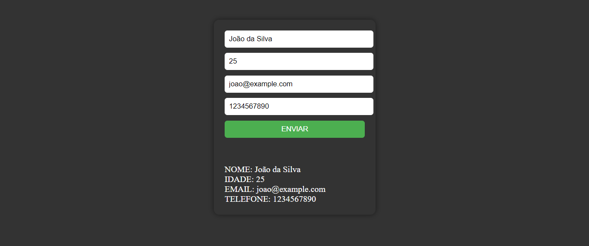

# FORMULARIO EM VUEJS CDN
👨‍🏫FORMULARIO EM HTML, CSS, JAVASCRIPT E VUEJS.

 <br>

## DESCRIÇÃO:
Este aplicativo é um simples formulário web construído com Vue.js e HTML/CSS/JS. Ele permite que os usuários preencham informações pessoais, como nome, idade, email e telefone, e enviem esses dados. Depois de enviar o formulário, os dados são exibidos em um formato específico abaixo do formulário.

## FUNCIONALIDADES:
- **Funcionalidade do Formulário**: Os usuários podem preencher os campos do formulário com informações pessoais.
- **Validação de Entrada**: O aplicativo valida os campos do formulário para garantir que estejam preenchidos corretamente antes de permitir o envio.
- **Exibição de Dados**: Após o envio bem-sucedido do formulário, os dados inseridos são exibidos em um formato específico abaixo do formulário.

## COMO USAR?
1. **Execução:** Abra o arquivo `CODIGO/CODIGO.html` em um navegador.
2. **Preencha os Campos**: Preencha todos os campos do formulário com suas informações pessoais. Exemplo:
- Nome: 
    ```javascript
    João da Silva
    ```
- Idade: 
    ```javascript
    25
    ```
- Email:
    ```javascript
    joao@example.com
    ```
- Telefone: 
    ```javascript
    1234567890
    ```
3. **Envie o Formulário**: Clique no botão "ENVIAR" para enviar o formulário.
4. **Validação de Entrada**: Se algum campo estiver vazio ou preenchido incorretamente, uma mensagem de alerta será exibida, solicitando que você preencha todos os campos corretamente.
5. **Visualize os Dados Enviados**: Após o envio bem-sucedido do formulário, os dados inseridos serão exibidos em um formato específico abaixo do formulário.

## NÃO SABE?
- Entendemos que para manipular arquivos em `HTML`, `CSS` e outras linguagens relacionadas, é necessário possuir conhecimento nessas áreas. Para auxiliar nesse aprendizado, oferecemos cursos gratuitos disponíveis:
* [CURSO DE HTML E CSS](https://github.com/VILHALVA/CURSO-DE-HTML-E-CSS)
* [CURSO DE JAVASCRIPT](https://github.com/VILHALVA/CURSO-DE-JAVASCRIPT)
* [CURSO DE VUEJS](https://github.com/VILHALVA/CURSO-DE-VUEJS)
* [CONFIRA MAIS CURSOS](https://github.com/VILHALVA?tab=repositories&q=+topic:CURSO)

## CREDITOS:
- [PROJETO CRIADO PELO VILHALVA](https://github.com/VILHALVA)


